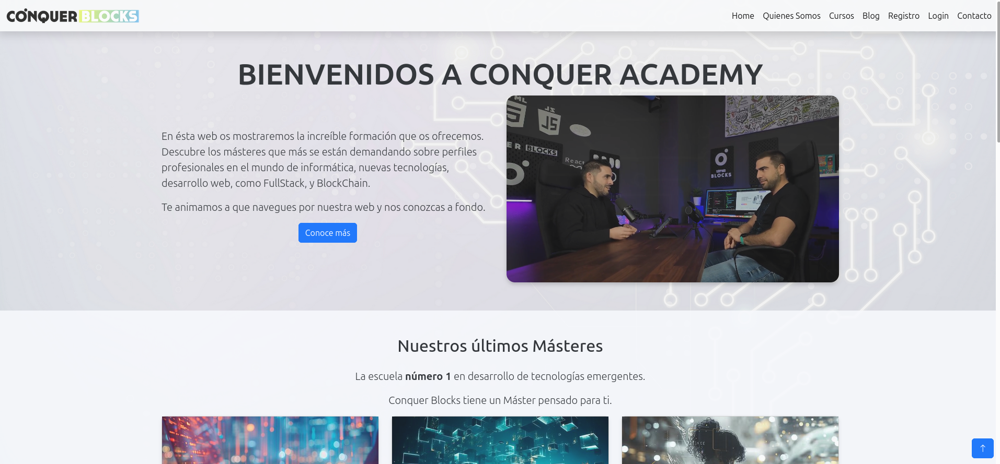

# Conquer Academy
## CSS Tarea Entregable 5 | Master Desarrollador Fullstack  de Conquer Blocks
Este proyecto pertenece a las proyectos evaluables del Master de desarrollador Fullstack de Conquer Blocks.
Se trata de un proyecto responsive, de la base del proyecto realizado solo con HTML en módulo anterior, en esta ocasión, se le da al mismo estilo con CSS (y utilizando Bootstrap):
La web estática consta  de 7 secciones: Home, Quienes Somos,Cursos,Blog,Registro,Login y Contacto.
### Puedes verlo en pages, en el siguiente enlace:
  [Conquer Academy](https://dclair.github.io/conquer_academy/)\
 
 
